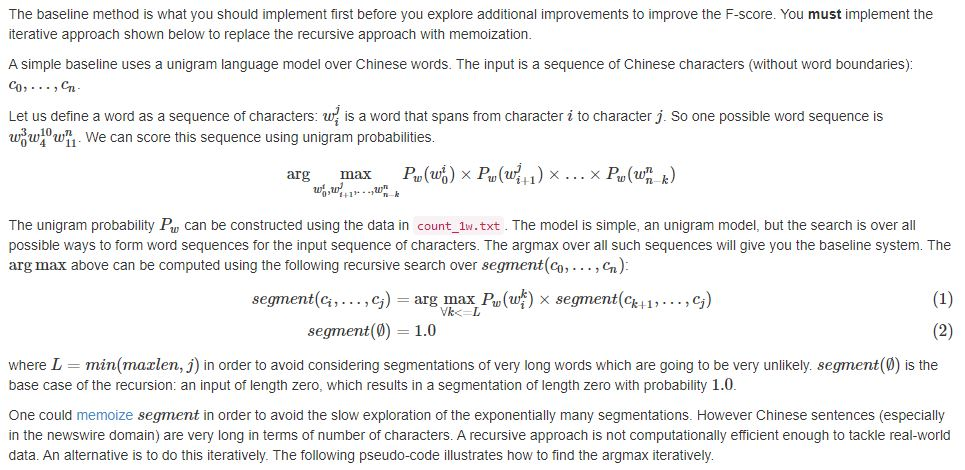

# Chinese Word Segmentation
Word segmentation is the task of restoring missing word boundaries. This project is on Chinese word segmentation, a language in which word boundaries are not usually provided. We will be using training data collected from Chinese sentences that have been segmented by human experts. We will run the word segmentation program that you will write for this homework on test data that will be automatically evaluated against a reference segmentation.

## Baseline

## Unigram Segmenter

The first major hurdle we ran into was when building the unigram segmenter class with no smoothing function. Our initial solution resulted in a dev score of 0.03 and output segments consistently being 5-6 characters long. Due to the segmentation output, we thought that this was a result of a bug in the unigram segmenter class code, but this was not the case.
After a lot of debugging and experimentation, we found that the code base was correct, but we needed a smoothing function to achieve a competitive score. We found that using a modified version of P. Norvig's smoothing function from the previous assignment achieved much better results. For the Chinese language, we found that penalizing large words more heavily resulted in better results when compared with English language segmentation. This could be due to a higher frequency of short words in the Chinese language when compared with the English language. The best dev score we were able to achieve using the unigram segmenter class was ~0.93.

### Correct Answer

中美在沪签订高科技合作协议  
新华社上海八月三十一日电(记者白国良、夏儒阁)  
“ 中美合作高科技项目签字仪式”今天在上海举行。

### Without Smoothing Function

中 美在沪签订高 科技合作协议  
新华社上海八 月三十一日电 (记者白国 良、夏儒阁)   
“中美合作 高科技项目签 字仪式”今天 在上海举行

### With Smoothing Function

中美在沪签订高科技合作协议  
新华社上海八月三十一日电(记者白国良、夏儒阁)  
“ 中美合作高科技项目签字仪式”今天在上海举行。

## Bigram Segmenter

The second iteration of the codebase was to implement a bigram model. The only difficulty we had here was choosing the correct smoothing function. We first implemented additive smoothing, but it yielded poor results (0.79). We then tried back-off smoothing which worked much better. We suspect that this is because the unigram model we build before was highly optimized. Our final iteration of the bigram model uses a modified backoff smoothing function that can be found on the slides here. This function adds an alpha parameter that scales the unigram probability when the complete bigram is not found.
Similar to the unigram class above, we can compare the correct segmentation output with the segmentation that was generated by the bigram model. The best dev score we achieved with this model was ~0.93. Interestingly this model is still slightly outperformed by the unigram model, but believe that this model will be more generalizable to the test set. We can see the output of the bigram model when compared with the true output below.

### Correct Output

美国商务部长布朗访问上海  
新华社上海八月三十一日电(记者周解蓉)

### Bigram Output

美国商务部长布朗访问上海  
新华社上海八月三十一日电(记者周解蓉)

## Installation

Make sure you setup your virtual environment:

    python3 -m venv venv
    source venv/bin/activate
    pip install -r requirements.txt

You can optionally copy and modify the requirements for when we
test your code:

    cp requirements.txt answer/requirements.txt

## Required files

You must create the following files:

    answer/zhsegment.py
    answer/zhsegment.ipynb

## Create output.zip

To create the `output.zip` file for upload to Coursys do:

    python3 zipout.py

For more options:

    python3 zipout.py -h

## Create source.zip

To create the `source.zip` file for upload to Coursys do:

    python3 zipsrc.py

For more options:

    python3 zipsrc.py -h

## Check your accuracy

To check your accuracy on the dev set:

    python3 check.py

For more options:

    python3 check.py -h

In particular use the log file to check your output evaluation:

    python3 check.py -l log

The accuracy on `data/input/test.txt` will not be shown.  We will
evaluate your output on the test input after the submission deadline.

## Default solution

The default solution is provided in `default.py`. To use the default
as your solution:

    cp default.py answer/zhsegment.py
    cp default.ipynb answer/zhsegment.ipynb
    python3 zipout.py
    python3 check.py

Make sure that the command line options are kept as they are in
`default.py`. You can add to them but you must not delete any
command line options that exist in `default.py`.

Submitting the default solution without modification will get you
zero marks.

## Data files

The data files provided are:

* `data/count_1w.txt` -- unigram word counts 
* `data/count_2w.txt` -- bigram word counts
* `data/input` -- input files `dev.txt` and `test.txt`
* `data/reference/dev.out` -- reference output for the `dev.txt` input file

